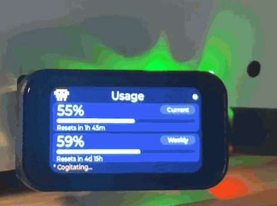

# 🦀 Clawdito

A little desk companion that shows your **Claude Code usage** in real time —
your 5-hour rate-limit window, your weekly cap, and what your sessions would
have cost in API dollars — on a 1.47" touchscreen, with a pixel-art Clawd
that blinks at you while you work.

Built for the **Waveshare ESP32-S3-Touch-LCD-1.47** (~$20 board), driven by a
small Python bridge that runs on the computer where Claude Code lives.

<p align="center">
  
</p>

## What it shows

Pages are navigable by **swiping** the touchscreen (or tapping the BOOT
button):

| Page | Content |
|---|---|
| **Usage** | Official rate limits: 5h window % + weekly % with progress bars and exact reset countdowns — the same numbers as `/usage` inside Claude Code |
| **Clawd** | A big pixel-art Clawd. It blinks. That's it. That's the page. |
| **Cost** | Today / this month / yesterday in API-equivalent dollars, plus a 7-day bar chart, parsed from your local Claude Code transcripts |
| **Both** | Only with two bridges configured: both accounts side by side — 5h, weekly and today's spend for each |

## Two accounts

If you run Claude Code on two computers under two different Anthropic
accounts (say personal and work), give Clawdito **both**. Each machine runs
the same unmodified bridge; the device polls both and holds two profiles:

- The setup page has a **Profile A** and an optional **Profile B** block.
- **Hold BOOT for 2 seconds** to flip which account the Usage and Cost pages
  show — the page title becomes the profile's name.
- The **Both** page shows both at once, with a per-account online dot.

Leave Profile B empty for a single bridge and nothing changes.

A rotating status word in Claude Code's spinner style ("Flibbertigibbeting…",
"Noodling…") keeps the bottom edge company.

## How it works

```
┌─────────────┐   WiFi (LAN only)   ┌──────────────────────────┐
│  Clawdito   │ ──── GET /usage ──► │  clawdito_bridge.py      │
│  (ESP32-S3) │ ◄─── JSON ───────── │  on your computer        │
└─────────────┘                     │  • official rate limits   │
                                    │    via your local Claude  │
                                    │    Code login             │
                                    │  • spend stats parsed     │
                                    │    from ~/.claude/        │
                                    └──────────────────────────┘
```

Everything stays on your LAN. The bridge reads your Claude Code OAuth
credential locally (macOS Keychain or `~/.claude/.credentials.json`) to ask
Anthropic's usage endpoint for your official limits — the credential never
leaves the bridge process, and the device only ever receives percentages.
The device endpoint is protected by a bearer token generated on first run.

## Quick start

**1. Run the bridge** (Python 3.10+, standard library only — no `pip install`):

```bash
python3 bridge/clawdito_bridge.py            # --host 0.0.0.0 --port 8787
```

Note the endpoint IP and token it prints. To keep it running across reboots,
see [Keeping the bridge running](#keeping-the-bridge-running).

**2. Flash the firmware** (PlatformIO):

```bash
cd firmware
pio run -t upload
```

**3. Provision the device.** On first boot the screen shows a WiFi network
(`Clawdito-XXXX`) and a one-time password. Join it from your phone, the
setup page pops up (or open `http://192.168.4.1`), pick your **2.4 GHz**
WiFi, paste the bridge IP + token, hit **Connect**. Done — numbers appear
within seconds.

BOOT gestures: **tap** = next page, **hold 2s** = switch profile,
**hold 5s** = wipe config and re-provision.

See [docs/SETUP.md](docs/SETUP.md) for details and troubleshooting, and
[docs/HARDWARE.md](docs/HARDWARE.md) for the board's pin map and its quirks
(there are several, and they were all earned the hard way).

## Keeping the bridge running

The device is only as live as the bridge. A bridge started by hand in a
terminal dies with that terminal — and with your next reboot. Ready-made
service definitions are in [`bridge/service/`](bridge/service):

```bash
# macOS (launchd)
cp bridge/service/com.clawdito.bridge.plist ~/Library/LaunchAgents/
# edit the two paths inside first, then:
launchctl load -w ~/Library/LaunchAgents/com.clawdito.bridge.plist

# Linux (systemd --user)
cp bridge/service/clawdito-bridge.service ~/.config/systemd/user/
systemctl --user enable --now clawdito-bridge
```

Both restart the bridge on crash and on login. See
[`bridge/service/README.md`](bridge/service/README.md) for the details,
including why the macOS unit is a **LaunchAgent** and not a LaunchDaemon
(it needs your login Keychain).

## The bridge API

Two routes, both read-only:

| Route | Auth | Returns |
|---|---|---|
| `GET /usage` | `Authorization: Bearer <token>` | `limits` (official 5h + weekly utilization and reset countdowns, cached 60s) and `today` / `month` / `last7` API-equivalent spend (cached 5s) |
| `GET /health` | none | `{"ok": true}` — liveness only, no data |

Nothing is writable and nothing is proxied to Anthropic on the device's
behalf beyond the usage read. If you want to drive your own display, poll
`/usage` and ignore the rest of this repo.

## Notes

- The ESP32 only does **2.4 GHz** WiFi. Your computer can stay on 5 GHz —
  both bands of the same router share a LAN.
- The cost figures are **API-equivalent estimates** priced via
  `bridge/pricing.json` — useful for trends, not an invoice. Rates for
  models without published API pricing are marked as assumptions in the file.
- The 5h/weekly percentages are **not** estimates — they're the official
  numbers from Anthropic's usage endpoint.
- The usage endpoint is **not a public, documented Anthropic API**. It's the
  one Claude Code itself uses, read with your own login. It can change
  without notice; if the Usage page goes blank one day, that's the likely
  reason.
- Unofficial project — not affiliated with or endorsed by Anthropic.

## Contributing

Issues and PRs welcome, especially **ports to other ESP32-S3 boards** —
the bridge is board-agnostic, so a port is mostly a display driver, a touch
driver and a pin map. See [CONTRIBUTING.md](CONTRIBUTING.md).

## Prior art

The genre — a small desk display showing Claude Code usage — was popularized
by [Clawdmeter](https://github.com/HermannBjorgvin/Clawdmeter), which is
worth a look if your board is one of the AMOLED Waveshare models it already
supports. Clawdito is an independent implementation for the 1.47" Touch LCD
board, with a LAN-HTTP bridge instead of BLE.

## License

MIT — see [LICENSE](LICENSE).
